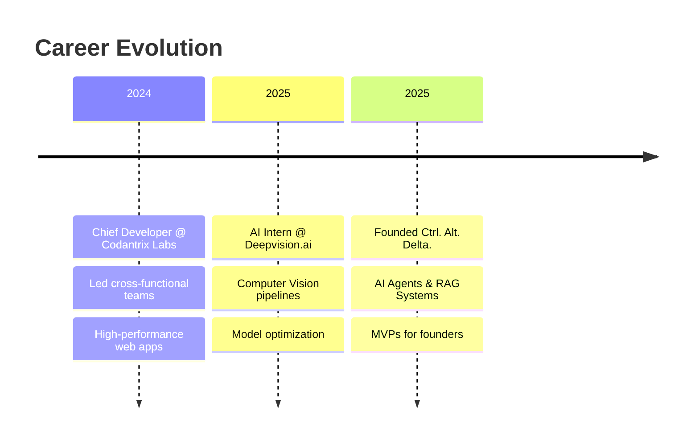

<div align="center">
  
# 👩‍💻 Zainab Hamid

[](https://git.io/typing-svg)


[](https://www.linkedin.com/in/zainab-hamid-187a18321/)
[](mailto:zainabhamid2468@gmail.com)
[](https://www.linkedin.com/company/ctrl-alt-delta/)
[](https://github.com/zyna-b)

> *"Building the bridge between complex AI and business ROI."* 🚀

</div>

---

## 🎯 About Me


I am the **Founder of [Ctrl. Alt. Delta.](https://www.linkedin.com/company/ctrl-alt-delta/)**, a software startup specializing in **AI Agents**, **MVPs**, and **Business Intelligence** systems.

As a **Full Stack AI Engineer**, I merge traditional web robustness (PHP/Laravel, MERN) with cutting-edge Deep Learning. I don't just train models — **I deploy them into scalable, revenue-generating products.**

<br>

| 🔭 **Currently Building** | High-ROI MVPs & Autonomous AI Agents for non-tech founders |
|:--------------------------|:-----------------------------------------------------------|
| 🌱 **Deep Dive**          | Agentic Workflows (LangChain/CrewAI) & Scalable RAG Systems |
| ⚡ **Philosophy**          | I don't just write code; **I ship MVPs that generate revenue** |
| 🎯 **Mission**            | Transform complex AI into tangible business outcomes |

<br clear="both">

---

## 💻 Competitive Programming & Problem Solving

<div align="center">

### 🏆 LeetCode Stats

[](https://leetcode.com/u/Zainab_Hamid/)

**Sharpening algorithmic thinking and problem-solving skills daily!** 🚀

</div>

---

## 🚀 Professional Journey

<div align="center">



</div>

<!-- In the Experience Highlights section, update the table to include Codantrix -->

### 🏢 Experience Highlights

<table>
<tr>
<td width="33%" valign="top">

#### 🚀 Founder
**Ctrl. Alt. Delta.**
*2025 – Present*

- 🤖 AI Agents & RAG Systems
- 🎯 MVPs for market testing  
- 📊 BI Dashboards

</td>
<td width="33%" valign="top">

#### 🤖 AI Intern
**Deepvision.ai**
*2025*

- 🔬 CV pipelines
- ⚡ Model optimization
- 🏭 Production ML systems

</td>
<td width="33%" valign="top">

#### 👩‍💻 Chief Developer
**Codantrix Labs**
*Nov 2024 – 2025*

- 🌐 Web applications
- 🎨 UX optimization
- 👥 Team leadership

</td>
</tr>
</table>

---

## 🛠️ Tech Arsenal

<div align="center">

### 🧠 Artificial Intelligence & Data Science
  


### 🤖 AI Engineering & LLMs


### 💻 Full-Stack Development


### ☁️ DevOps & Cloud


</div>

---

## 🏆 Featured Projects

<div align="center">

<table>
<tr>
<td width="50%" valign="top">

### 🏢 HirePrint AI
**B2B Freelance Marketplace**


A freelance marketplace platform built with **PHP/Laravel** enhanced with AI features.

**Tech Stack:**
```
PHP • Laravel • MySQL • AI Matching
```

**Impact:** Streamlines hiring for print-on-demand businesses

[](#)

</td>
<td width="50%" valign="top">

### 🩺 Malaria Cell Detection
**Medical AI System**


Medical-grade CNN model for diagnosing parasitized cells with **95.7% accuracy**.

**Tech Stack:**
```
TensorFlow • Keras • CNN • OpenCV
```

**Impact:** Assists medical professionals in rapid diagnosis

[](#)

</td>
</tr>
<tr>
<td width="50%" valign="top">

### 🏦 Bank Conversion Intelligence
**ML Predictive System**


ML system predicting term deposit subscriptions using Random Forest with SMOTE.

**Tech Stack:**
```
Python • Scikit-learn • Pandas • Seaborn
```

**Impact:** Optimizes bank marketing campaigns

[](https://github.com/zyna-b/Bank-Conversion-Intelligence)

</td>
<td width="50%" valign="top">

### 🧪 AI Research Labs
**Neural Network Playground**


Repository of advanced neural architectures implemented from scratch.

**Includes:**
```
CNNs • RNNs • GANs • Transformers
```

**Purpose:** Deep learning exploration & experimentation

[](#)

</td>
</tr>
</table>

</div>

---

## 📜 Certifications

<div align="center">

| Badge | Certification | Issuer |
|:-----:|:--------------|:-------|
|  | **Intro to Generative AI** | Google Cloud Skills Boost |
|  | **Machine Learning Fundamentals** | AWS Educate |
|  | **Foundations of SQL & Database Querying** | SoloLearn |

</div>

---

## 📊 GitHub Analytics

<div align="center">
  


</div>

<div align="center">
  
### 📈 Contribution Graph
  


</div>

---

## 🐍 Contribution Snake

<div align="center">
  

</div>

---

## 💼 Let's Build Something Amazing

<div align="center">

### Ready to transform your idea into a revenue-generating product?


<br>

| 🏢 **Company** | 💼 **LinkedIn** | 📧 **Email** |
|:-------------:|:---------------:|:------------:|
| [](https://www.linkedin.com/company/ctrl-alt-delta/) | [](https://www.linkedin.com/in/zainab-hamid-187a18321/) | [](mailto:zainabhamid2468@gmail.com) |

<br>

### 🤝 Services I Offer

<table>
<tr>
<td align="center" width="33%">
<br>
<b>AI Agents & Automation</b><br>
<sub>Custom AI solutions for business processes</sub>
</td>
<td align="center" width="33%">
<br>
<b>MVP Development</b><br>
<sub>Rapid prototyping to market-ready products</sub>
</td>
<td align="center" width="33%">
<br>
<b>Business Intelligence</b><br>
<sub>Data-driven decision making systems</sub>
</td>
</tr>
</table>

</div>

---

<div align="center">


**⭐ If you find my work interesting, consider giving my repos a star!**


</div>

</div>
